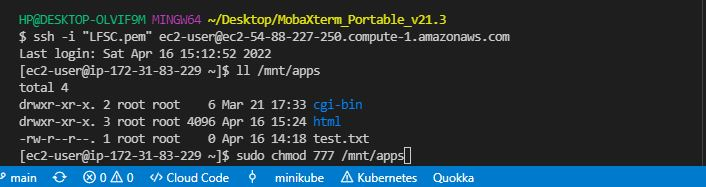

# Documentation for Project 9 - Automation with Jenkins
- Step 1 -- Setup Servers on AWS 
  
   - `sudo apt-get update && sudo apt-get upgrade` 
   - `sudo nano shell.sh && sudo chmod +x shell.sh`
  
### Bash Script to setup Jenkins

    ```
    #!/bin/bash
    sudo apt update -y
    sudo apt install default-jdk-headless -y

    wget -q -O - https://pkg.jenkins.io/debian-stable/jenkins.io.key | sudo apt-key add -
    sudo sh -c 'echo deb https://pkg.jenkins.io/debian-stable binary/ > \
    /etc/apt/sources.list.d/jenkins.list'
    sudo apt update -y
    sudo apt-get install jenkins -y 
    ```

### Run bash script 

    `sudo su  && ./shell.sh`

   -  
  
   -  

### Setting Up Jenkins 

   -  
  
   -  
  
   -  

## Builds 

   -  
  
   -  
  
   -  
  
   -  
  
### Configure Build from Github

   -  
  
   -  
  
   -  
  
   -  
  
   -  
  
